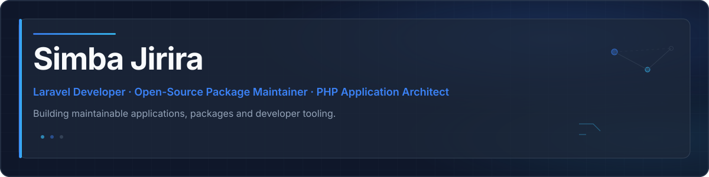

<picture>
  <source media="(prefers-color-scheme: light)" srcset="assets/profile-header.svg">
  <source media="(prefers-color-scheme: dark)" srcset="assets/profile-header.svg">
  
</picture>

  
  
  
  
  
  

I build Laravel applications, reusable Laravel packages, and maintainable backend systems — with an emphasis on clean architecture, automated testing, and production-quality engineering.

## About

My work centres on PHP and Laravel: application architecture, Livewire-powered interfaces, developer tooling, and open-source packages that other teams can adopt with confidence.

I focus on maintainable codebases, clear APIs, reusable components, and developer experience — from Artisan commands and service providers to CI-backed release workflows.

## Open Source

Public Laravel packages I maintain.

<h3><a href="https://github.com/simba-jirira-source/laravel-schema-contract">Laravel Schema Contract</a></h3>

Developer tooling that detects inconsistencies between Laravel database schema metadata and Eloquent model casts. Discovers models, reads live schema metadata, normalizes types, and reports contract violations with CI-friendly exit codes. Read-only analysis — no schema or data mutations.

  
  
  
  
  

<strong>SQLite · MySQL · PostgreSQL</strong>

 

<h3><a href="https://github.com/simba-jirira-source/laravel-analytics">Laravel Analytics</a></h3>

First-party, self-hosted application analytics for Laravel. Track page views, unique visitors, HTTP errors, and optional IP bans in your application's own database, with an optional Livewire dashboard. Privacy-aware by default — tracking, raw IP storage, and the dashboard are disabled until explicitly enabled.

  
  
  
  
  

<strong>SQLite · MySQL · PostgreSQL</strong>

## Current Focus

- **Package Development** — Laravel package development and maintenance
- **Application Architecture** — Reusable developer tooling and scaffolding
- **Livewire Applications** — Laravel-native UI patterns
- **Testing & Quality** — Automated testing, static analysis, and CI/CD with GitHub Actions
- **Developer Tooling** — Application scaffolding and internal tooling

## Core Stack

  <strong>Backend</strong> 
  
  
  

  <strong>Frontend</strong> 
  
  
  
  

  <strong>Testing &amp; Quality</strong> 
  
  
  

  <strong>Data</strong> 
  
  
  

  <strong>DevOps</strong> 
  
  
  
  
  

## Engineering Principles

- Maintainable architecture over quick fixes
- Automated testing and static analysis in CI
- Clear, documented APIs for packages and components
- Reusable components with sensible defaults
- Semantic versioning for open-source releases
- Backward compatibility where appropriate
- Useful developer documentation

## GitHub Activity

  
  

  
  

## Currently Listening

## Contact

  
  
  

