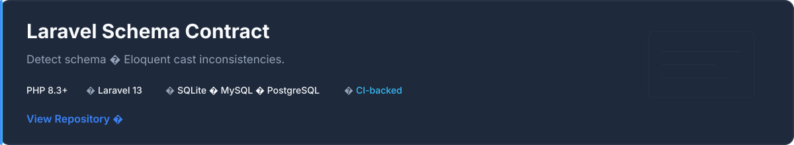
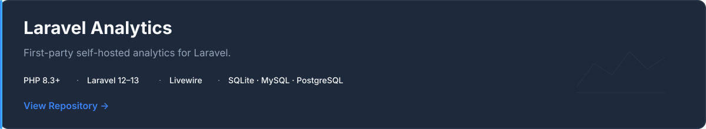

[Portfolio](https://simbajirira.com/) · [Schema Contract](https://github.com/simba-jirira-source/laravel-schema-contract) · [Laravel Analytics](https://github.com/simba-jirira-source/laravel-analytics) · [Email](mailto:github@simbajirira.com)

I build Laravel applications, reusable Laravel packages, and maintainable backend systems — with an emphasis on clean architecture, automated testing, and production-quality engineering.

## About

My work centres on PHP and Laravel: application architecture, Livewire-powered interfaces, developer tooling, and open-source packages that other teams can adopt with confidence.

I focus on maintainable codebases, clear APIs, reusable components, and developer experience — from Artisan commands and service providers to CI-backed release workflows.

## Open Source

Public Laravel packages I maintain.

Developer tooling that detects inconsistencies between Laravel database schema metadata and Eloquent model casts. Discovers models, reads live schema metadata, normalizes types, and reports contract violations with CI-friendly exit codes. Read-only analysis — no schema or data mutations.

First-party, self-hosted application analytics for Laravel. Track page views, unique visitors, HTTP errors, and optional IP bans in your application's own database, with an optional Livewire dashboard. Privacy-aware by default — tracking, raw IP storage, and the dashboard are disabled until explicitly enabled.

## Current Focus

- **Package engineering** — Laravel packages and reusable developer tooling
- **Application architecture** — Maintainable Laravel application design
- **Livewire** — Laravel-native interactive applications
- **Quality engineering** — Pest, static analysis and CI
- **Automation** — GitHub Actions and development workflows

## Core Stack

**Backend**

`PHP` `Laravel` `Livewire`

**Frontend**

`Tailwind CSS` `Alpine.js` `JavaScript` `Vite`

**Testing & Quality**

`Pest` `PHPUnit` `Laravel Pint`

**Data**

`MySQL` `PostgreSQL` `SQLite`

**Infrastructure**

`Docker` `Linux` `Git` `GitHub Actions` `Nginx`

## Engineering Principles

- Maintainable architecture over quick fixes
- Automated testing and static analysis
- Clear documented APIs
- Semantic versioning and compatibility
- Useful developer documentation

## Currently Listening

## Contact

[Portfolio](https://simbajirira.com/) · [GitHub](https://github.com/simba-jirira-source) · [Email](mailto:github@simbajirira.com)
